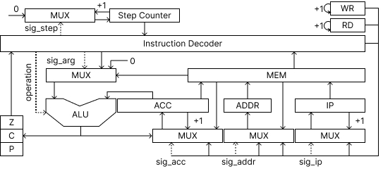

# Архитектура компьютера  
# Лабораторная работа №3 

## О проекте

+ Степанов Михаил Алексеевич
+  `asm | acc | neum | mc | tick | struct | stream | mem | prob5`


***

## Язык программирования [Assembler]

Примечания:
+ Каждая строка рассматривается как отдельная операция (или метка).
+ Модель вычислений построена вокруг аккумулятора, результат всех вычислений записывается в аккумулятор и берется из него же.
+ Переменные имеют глобальную область видимости.

### Синтаксис языка

``` ebnf
<Program>  := ".data:" <Pointers> ".text:" <Commands>
           | ".text:" <Commands>
          
<Pointers> := ""
           | <Pointer> <Pointers>
          
<Pointer>  := <Word> <Number>
           | <Word> "'" <Word> "'"
        
<Commands> := ""
           | <Command> <Commands>
           
<Command> := <Op0>
           | <Op1> <Number>
           | <Op1> <Word>
           | <OpJmp> "." <Word>
           | "." <Word> ":"
           
<Op0>      := "prt" | "rd" | "hlt"

<Op1>      := "ld" | "sv" | "add" | "sub" | "mul" | "div" | "cmp" | "pprt"

<OpJmp>    := "jmp" | "je" | "jne" | "jg" | "jl" | "jc"

<Word>     := <letter> <chars> 

<chars>    := <AnyChar> <chars>
           | ""

<AnyChar>  := <letter> | <digit>

<letter>   := "a" | "b" | ... | "z" | "A" | "B" | ... | "Z" | "_"

<Number>   := <digit> <Number>

<digit>    := "0" | "1" | ... | "9"
```

### Операции

Код начинается с точки входа (метки text) и выполняется последовательно. Операции:
+ ld - Загрузить значение в аккумулятор.
+ sv - Сохранить значение в память по адресу.
+ rd - Прочитать следующий символ из области IO.
+ prt - Записать символ в область IO.
+ add - Прибавить значение к аккумулятору.
+ sub - Вычесть значение из аккумулятора.
+ mul - Умножить значение на аккумулятор.
+ div - Разделить аккумулятор на число.
+ cmp - Выставить флаги выполнения операции sub без записи результата в аккумулятор.
+ jmp - Безусловный переход.
+ je - Переход если Z=1.
+ jne - Переход если Z=0.
+ jg - Переход если P=1.
+ jl - Переход если P=0 && Z=0.
+ jc - Переход если C=1.
+ pprt - Распечатать символ находящийся по адресу, который хранится в указанной ячейке и инкрементировать.
+ hlt - Остановка моделирования.

Разрешается использование однострочных комментариев, они пишутся после символов "//"

***

## Система команд

Особенности процессора:

+ Машинное слово -- 64 бита, знаковое.
+ Используемые регистры:

| Мнемоника |          Описание           | Размерность |      Операции по изменению       |
|:---------:|:---------------------------:|:-----------:|:--------------------------------:|
|    ACC    |         Аккумулятор         |   64 бит    |   +1, ALU, Загрузка из команды   |
|   ADDR    |            Адрес            |   16 бит    | Загрузка из команды, RD, WR, MEM |
|    IP     |      Указатель команд       |   16 бит    |     +1, Загрузка из команды      |
|    ZCP    |     Флаги для переходов     |   3 бита    |               ALU                |
|    SC     |       Счетчик тактов        |    8 бит    |              +1, 0               |
|    WR     | Указатель на область записи |   16 бит    |                +1                |
|    RD     | Указатель на область чтения |   16 бит    |                +1                |

## Набор инструкций

Синтаксис и мнемоники совпадают.

+ В качестве аргумента операций перехода может быть использована метка.
+ В качестве аргументов остальных операций может быть использован указатель (по его имени) или число.

| Syntax | Кол-во тактов |  Аргумент  |                                   Комментарий                                    |
|:------:|:-------------:|:----------:|:--------------------------------------------------------------------------------:|
|  hlt   |       0       |     -      |                               Остановка модуляции                                |             
|   ld   |      1/2      | value/addr |                      Количество тактов зависит от адресации                      |             
|   sv   |      1/2      | value/addr |                      Количество тактов зависит от адресации                      |             
|  prt   |       2       |     -      |                        Распечатывает символ по адресу WR                         |             
|   rd   |       2       |     -      |                            Читает символ по адресу RD                            |             
|  add   |      1/2      | value/addr |                      Количество тактов зависит от адресации                      |             
|  sub   |      1/2      | value/addr |                      Количество тактов зависит от адресации                      |             
|  mul   |      1/2      | value/addr |                      Количество тактов зависит от адресации                      |             
|  div   |      1/2      | value/addr |                      Количество тактов зависит от адресации                      |             
|  cmp   |      1/2      | value/addr |                      Количество тактов зависит от адресации                      |             
|  jmp   |       1       |    addr    |                               Безусловный переход                                |             
|   je   |       1       |    addr    |                                Переход по условию                                |             
|  jne   |       1       |    addr    |                                Переход по условию                                |             
|   jg   |       1       |    addr    |                                Переход по условию                                |             
|   jl   |       1       |    addr    |                                Переход по условию                                |             
|   jc   |       1       |    addr    |                                Переход по условию                                |             
|  pprt  |       9       |    addr    | Инкриминирует значение по адресу печатает символ находящийся по адресу из ячейки |             

### Кодирование инструкций

+ Машинный код хранится в виде объекта JSON.
+ В объекте три поля:
1. pointers - объект JSON: ключ - номер указателя, значение - данные, хранимые по указателю
2. labels - объект JSON: ключ - номер метки, значение - значение IP для перехода.
3. program - список JSON объектов: Одна инструкция - один объект, индекс - адрес для перехода.

## Транслятор

Интерфейс командной строки: `translator.py <input_file> <output_file>`

Реализовано в модуле: [translator](src/translator.py)

Этапы трансляции:
1. Поиск секций, меток и указателей по файлу.
2. Замена меток и указателей на условные символы и проверка их корректности.
3. Трансформирование текста программы в последовательность термов.

## Модель процессора

Интерфейс командной строки: `machine.py <parsed_file> [input_file]`

Реализовано в модуле: [machine](src/machine.py)

Было принято решение не разделять DataPath и ControlUnit.



Сигналы (обрабатываются за один такт, реализованы в виде методов класса):

+ latch_acc -- защёлкнуть аккумулятор. Принимает управляющий сигнал, указывающий на источник данных;
+ latch_addr -- защёлкнуть адресный регистр. Принимает управляющий сигнал, указывающий на источник данных;
+ latch_step_counter -- защелкнуть счетчик шагов исполнения инструкции. Принимает управляющий сигнал, указывающий на источник данных;
+ latch_ip -- защелкнуть instruction pointer. Принимает управляющий сигнал, указывающий на источник данных;
+ latch_mem -- выгрузить данные из аккумулятора в память;

Флаги:

+ Z - zero
+ P - positive
+ C - carry

Моделирование производилось на уровне микрокоманд.
Трансляция инструкций в последовательность сигналов - decode_and_execute.

Особенности модели:

+ Для журналирования используется модуль `logging`.
+ Количество исполненных операций ограничено константой.
+ Остановка модуляции определяется по возвращаемому значению функции.
+ Запуск симуляции происходит при вызове функции `simulate`.

## Апробация

Для тестов использовано несколько алгоритмов:

1. [Hello World](src/asm/hw.asm)
2. [Cat](src/asm/cat.asm)
3. [Math Function](src/asm/func.asm)
4. [5th Euler's Problem](src/asm/prob5.asm)

Интеграционные тесты реализованы в модуле: [Integration test](test/integration_test.py)
Unit-тесты реализованы в модуле: [Unit test](test/unit_test.py)

CL:
```yaml
lab3-example:
  stage: test
  image:
    name: python-tools
    entrypoint: [""]
  script:
    - python3-coverage run -m pytest --verbose
    - find . -type f -name "*.py" | xargs -t python3-coverage report
    - find . -type f -name "*.py" | xargs -t pep8 --ignore=E501
    - find . -type f -name "*.py" | xargs -t pylint
```
где:
- `python3-coverage` -- формирование отчёта об уровне покрытия исходного кода.
- `pytest` -- утилита для запуска тестов.
- `pep8` -- утилита для проверки форматирования кода. `E501` (длина строк) отключено.
- `pylint` -- утилита для проверки качества кода. Некоторые правила отключены в отдельных модулях с целью упрощения кода.
- `mypy` -- утилита для проверки корректности статической типизации.
  - `--check-untyped-defs` -- дополнительная проверка.
  - `--explicit-package-bases` и `--namespace-packages` -- помогает правильно искать импортированные модули.
- Docker image `python-tools` включает в себя все перечисленные утилиты. Его конфигурация: [Dockerfile](./Dockerfile).

Пример использования и журнал работы процессора на примере [Cat](src/asm/cat.asm):

```example
$ cat input_files/cat.input 
[67, 65, 84]
$ cat asm/cat.asm
.data:
.text:
    .start:
        rd
        prt
        je .hlt
        jmp .start
    .hlt:
        hlt
$ python translator.py asm/cat.asm asm/cat.json
$ cat asm/cat.json
{"labels":{"0": 0, "1": 4},"pointers":{},"program":[{"operation":"rd","operand":"None","type":"data"}, {"operation":"prt","operand":"None","type":"data"}, {"operation":"je","ope
rand":"1","type":"label"}, {"operation":"jmp","operand":"0","type":"label"}, {"operation":"hlt","operand":"None","type":"data"}]}
$ python machine.py asm/cat.json input_files/cat.input 
DEBUG:root:TICK: 0, ADDR: 0, IP: 0, ACC: 0, ZCP: 101, SC: 0, WR: 6, RD: 25
OP: rd, ARG: None, T: data, D: -8565524770379116096
DEBUG:root:TICK: 1, ADDR: 25, IP: 0, ACC: 0, ZCP: 101, SC: 1, WR: 6, RD: 26
OP: rd, ARG: None, T: data, D: -8565524770379116096
DEBUG:root:TICK: 2, ADDR: 25, IP: 1, ACC: 67, ZCP: 001, SC: 0, WR: 6, RD: 26
OP: prt, ARG: None, T: data, D: 6034870251380461023
DEBUG:root:TICK: 3, ADDR: 6, IP: 1, ACC: 67, ZCP: 001, SC: 1, WR: 7, RD: 26
OP: prt, ARG: None, T: data, D: 6034870251380461023
DEBUG:root:TICK: 4, ADDR: 6, IP: 2, ACC: 67, ZCP: 001, SC: 0, WR: 7, RD: 26
OP: je, ARG: 1, T: label, D: -3479038006839116491
DEBUG:root:TICK: 5, ADDR: 6, IP: 3, ACC: 67, ZCP: 001, SC: 0, WR: 7, RD: 26
OP: jmp, ARG: 0, T: label, D: -5865404304628819528
DEBUG:root:TICK: 6, ADDR: 6, IP: 0, ACC: 67, ZCP: 001, SC: 0, WR: 7, RD: 26
OP: rd, ARG: None, T: data, D: -8565524770379116096
DEBUG:root:TICK: 7, ADDR: 26, IP: 0, ACC: 67, ZCP: 001, SC: 1, WR: 7, RD: 27
OP: rd, ARG: None, T: data, D: -8565524770379116096
DEBUG:root:TICK: 8, ADDR: 26, IP: 1, ACC: 65, ZCP: 001, SC: 0, WR: 7, RD: 27
OP: prt, ARG: None, T: data, D: 6034870251380461023
DEBUG:root:TICK: 9, ADDR: 7, IP: 1, ACC: 65, ZCP: 001, SC: 1, WR: 8, RD: 27
OP: prt, ARG: None, T: data, D: 6034870251380461023
DEBUG:root:TICK: 10, ADDR: 7, IP: 2, ACC: 65, ZCP: 001, SC: 0, WR: 8, RD: 27
OP: je, ARG: 1, T: label, D: -3479038006839116491
DEBUG:root:TICK: 11, ADDR: 7, IP: 3, ACC: 65, ZCP: 001, SC: 0, WR: 8, RD: 27
OP: jmp, ARG: 0, T: label, D: -5865404304628819528
DEBUG:root:TICK: 12, ADDR: 7, IP: 0, ACC: 65, ZCP: 001, SC: 0, WR: 8, RD: 27
OP: rd, ARG: None, T: data, D: -8565524770379116096
DEBUG:root:TICK: 13, ADDR: 27, IP: 0, ACC: 65, ZCP: 001, SC: 1, WR: 8, RD: 28
OP: rd, ARG: None, T: data, D: -8565524770379116096
DEBUG:root:TICK: 14, ADDR: 27, IP: 1, ACC: 84, ZCP: 001, SC: 0, WR: 8, RD: 28
OP: prt, ARG: None, T: data, D: 6034870251380461023
DEBUG:root:TICK: 15, ADDR: 8, IP: 1, ACC: 84, ZCP: 001, SC: 1, WR: 9, RD: 28
OP: prt, ARG: None, T: data, D: 6034870251380461023
DEBUG:root:TICK: 16, ADDR: 8, IP: 2, ACC: 84, ZCP: 001, SC: 0, WR: 9, RD: 28
OP: je, ARG: 1, T: label, D: -3479038006839116491
DEBUG:root:TICK: 17, ADDR: 8, IP: 3, ACC: 84, ZCP: 001, SC: 0, WR: 9, RD: 28
OP: jmp, ARG: 0, T: label, D: -5865404304628819528
DEBUG:root:TICK: 18, ADDR: 8, IP: 0, ACC: 84, ZCP: 001, SC: 0, WR: 9, RD: 28
OP: rd, ARG: None, T: data, D: -8565524770379116096
DEBUG:root:TICK: 19, ADDR: 28, IP: 0, ACC: 84, ZCP: 001, SC: 1, WR: 9, RD: 29
OP: rd, ARG: None, T: data, D: -8565524770379116096
DEBUG:root:TICK: 20, ADDR: 28, IP: 1, ACC: 0, ZCP: 101, SC: 0, WR: 9, RD: 29
OP: prt, ARG: None, T: data, D: 6034870251380461023
DEBUG:root:TICK: 21, ADDR: 9, IP: 1, ACC: 0, ZCP: 101, SC: 1, WR: 10, RD: 29
OP: prt, ARG: None, T: data, D: 6034870251380461023
DEBUG:root:TICK: 22, ADDR: 9, IP: 2, ACC: 0, ZCP: 101, SC: 0, WR: 10, RD: 29
OP: je, ARG: 1, T: label, D: -3479038006839116491
DEBUG:root:TICK: 23, ADDR: 9, IP: 4, ACC: 0, ZCP: 101, SC: 0, WR: 10, RD: 29
OP: hlt, ARG: None, T: data, D: 7112050030747962257
Output: ['C', 'A', 'T']
Instruction Counter: 15
Ticks: 24
```

| ФИО               | алг.  | LoC | code байт | code инстр. | инстр. | такт. | вариант |
|-------------------|-------|-----|-----------|-------------|--------|-------|---------|
| Степанов М. А.    | hello | 9   | -         | 9           | 41     | 154   | -       |
| Степанов М. А.    | cat   | 9   | -         | 9           | 15     | 24    | -       |
| Степанов М. А.    | prob5 | 41  | -         | 41          | 1242   | 1885  | -       |
